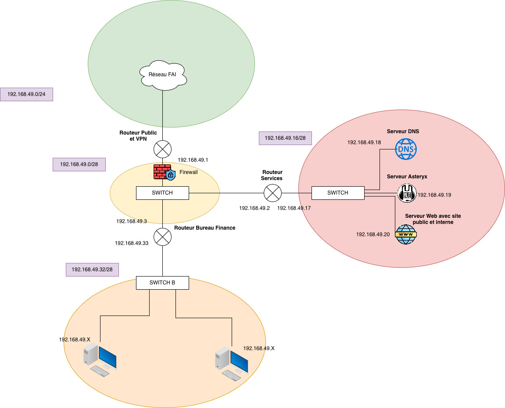

# Réseau de l'entreprise 

Le réseau de l'entreprise est constitué de :

- Un sous-réseau avec les services de l'entreprise : **VoIP**, **DNS**, **serveur WEB**
- Un sous-réseau (réplicable) avec des **machines utilisateurs** (ex : Service RH, Service Financier)
- Un **serveur VPN** situé sur le routeur public, qui relie Internet au réseau interne
- Trois routeurs portant les noms :
  - **routeur public**
  - **routeur services**
  - **routeur machine**

---

## Schéma de l'infrastructure



---

## Sous-réseau Services (IP fixes)

Le sous-réseau *Services* contient toutes les machines essentielles :  

| Service | IP | Description |
|--------|---------|------------|
| DNS (Bind9) | **192.168.49.18** | Résolution interne/externe |
| Serveur Web (NGINX) | **192.168.49.20** | Héberge les sites interne et externe |
| Serveur VoIP | **192.168.49.19** | Service téléphonie interne |

Toutes les machines du réseau Services utilisent **des adresses IP fixes**, configurées dans leurs scripts de démarrage.

---

## Sous-réseau Machines (DHCP)

Le sous-réseau Machines correspond aux ordinateurs des employés.

- Ils sont **en DHCP** et reçoivent automatiquement :
  - Leur **adresse IP**
  - Le **DNS interne** : `192.168.49.18`  
  - La **passerelle** : routeur machine

Ce réseau peut être **répliqué** (plusieurs réseaux RH/Finances suivant le même modèle).

### Configuration DHCP — Sous-réseau Machines

Le sous-réseau Machines utilise un serveur DHCP pour attribuer automatiquement les paramètres réseau aux postes utilisateurs.

#### Paramètres globaux DHCP

- **default-lease-time** : 600 secondes  
- **max-lease-time** : 7200 secondes  
- **authoritative** : indique que ce serveur est la source officielle pour ce réseau

#### Plage DHCP distribuée

Le serveur DHCP attribue des adresses IP dans le sous-réseau suivant :

- **Sous-réseau** : `192.168.49.32/28`
- **Plage d’adresses** : `192.168.49.34` → `192.168.49.46`
- **Passerelle (routeur machines)** : `192.168.49.33`
- **DNS interne** : `192.168.49.18`
- **Broadcast** : `192.168.49.47`

#### Contenu du fichier `dhcpd.conf`

```conf
default-lease-time 600;
max-lease-time 7200;

authoritative;

subnet 192.168.49.32 netmask 255.255.255.240 {
  range 192.168.49.34 192.168.49.46;
  option subnet-mask 255.255.255.240;
  option broadcast-address 192.168.49.47;
  option routers 192.168.49.33;
  option domain-name-servers 192.168.49.18;
}
```

---

## Serveur Web

Le serveur web tourne sur **NGINX**, adresse IP : **192.168.49.20**

Deux sites sont proposés :

### Site interne
- **Nom de domaine** : `intra.site.lan`
- **Chemin serveur** : `/intranet`
- **Accessibilité** : uniquement depuis l’intérieur de l’entreprise  
  (filtré via NGINX + firewall)

### Site externe
- **Nom de domaine** : `www.site.lan`
- **Chemin serveur** : `/public`
- **Accessibilité** : accessible partout (via IP publique du routeur public)

### Exemple de test de téléchargement de la page public depuis le réseau interne

Pour lancer le téléchargement :
```bash
wget --header="Host: www.site.lan" http://192.168.49.20/
```

---

## Serveur DNS

Le serveur DNS utilise **Bind9**, IP : **192.168.49.18**

Il fournit deux types de résolutions :

### Résolution interne
Pour les machines du réseau interne :

| Nom de domaine | Adresse renvoyée |
|----------------|------------------|
| `intra.site.lan` | **192.168.49.20** |
| `www.site.lan` | **192.168.49.20** |

### Résolution externe
Pour les utilisateurs extérieurs :

| Nom de domaine | Adresse renvoyée |
|----------------|------------------|
| `www.site.lan` | **120.0.50.2** (IP publique du routeur public) |

---

## Règles Firewall — Routeur Public

Le **routeur public** protège le réseau interne contre Internet.  
Il applique les règles suivantes :

### **Filtrage entrant (depuis Internet : 120.0.48.0/20)**

**Autorisé uniquement :**
- Port **80/tcp** → serveur web (HTTP)
- Port **53/udp/tcp** → serveur DNS

Toutes les autres connexions entrantes sont **bloquées**.

### Protection des services internes

- **On ne peut pas ping** le serveur DNS ou le serveur Web depuis l’extérieur.
- Aucun autre port (SSH, VoIP, intranet, etc.) n'est exposé publiquement.

### NAT (sortant)

Tout le trafic sortant depuis le réseau interne est **masqué** (MASQUERADE)  
→ Les machines internes apparaissent avec l’IP publique **120.0.50.2**

Ainsi :
- Les machines internes peuvent accéder à Internet
- Internet ne peut pas initier de connexion vers le LAN

---

## Résumé global

- Le **réseau Services** fonctionne avec des **IP fixes**
- Le **réseau Machines** fonctionne en **DHCP**
- Le **DNS interne** résout différemment selon l’origine de la requête (LAN / Internet)
- Le **serveur Web** sépare les contenus internes et externes  
- Le **routeur public** protège l’infrastructure avec un firewall strict + NAT

---
