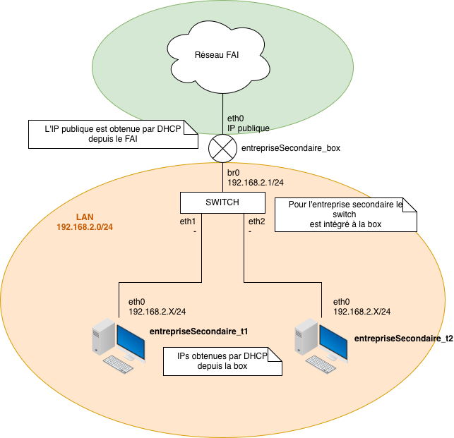

# Réseau d'entreprise secondaire

Un réseau d'entreprise secondaire est composé de :

* Un routeur/box jouant le rôle de **serveur DHCP** permettant d'attribuer des adresses IP dynamiques aux machines du LAN et assurant l'accès vers l'extérieur via **NAT**.
* De plusieurs machines clientes connectées au routeur.

Le fonctionnement global est **similaire au réseau de particulier**, à la différence suivante :

* **Les machines clientes ne nécessitent pas d'identifiant de réseau lors de leur lancement**.

Voici un schéma d'un réseau obtenu en faisant `./start.sh A`


---

## Procédure de déploiement

### Dépendances

* Docker

### Démarrage du réseau d'entreprise secondaire

Pour démarrer un réseau d'entreprise secondaire isolé :

```bash
chmod u+x ./start.sh
./start.sh
```

Contrairement au réseau de particulier, **aucun identifiant (A, B, C, …) n'est requis** pour lancer les machines clientes.

### Arrêt du réseau

Pour arrêter le réseau d'entreprise secondaire :

```bash
chmod u+x ./stop.sh
./stop.sh
```

---

## Accès aux machines

Les machines du réseau d'entreprise secondaire portent les noms suivants :

* `entrepriseSecondaire_box` pour le routeur/box
* `entrepriseSecondaire_t1`
* `entrepriseSecondaire_t2`

### Accès à un terminal

Pour ouvrir un terminal sur une machine :

```bash
docker exec -it nom_machine bash
```

### Capture réseau avec Wireshark

Pour ouvrir Wireshark depuis le namespace réseau d'une machine (Wireshark doit être installé sur l'hôte) :

```bash
sudo ip netns exec nom_machine wireshark
```

---

## Configuration

* Le **serveur DHCP** est configuré dans le fichier [dhcpd.conf](./configs/dhcpd.conf).
* Le **NAT** et les règles de routage sont configurés dans le script [script_box.sh](./scripts/script_box.sh).

Les paramètres sont identiques à ceux du réseau de particulier, sauf indication contraire spécifique au réseau d'entreprise secondaire.

