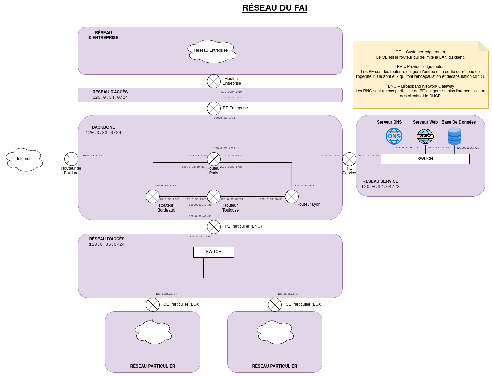

# Réseau FAI

## Procédure de déploiement

Dépendances :
 - Docker

Pour démarrer le reseau fai :
```bash
chmod u+x ./start.sh
./start.sh
```

Pour arrêter un réseau de particulier A :
```bash
chmod u+x ./stop.sh
./stop.sh
```

## Accès aux machines


Pour ouvrir un terminal sur un routeur:
```bash
docker exec -it nom_routeur bash
```

Pour ouvrir wireshark en tant qu'une machine du réseau (nécessite Wireshark installé sur l'hôte) :
```bash
sudo ip netns exec nom_machine wireshark
```

## Configuration