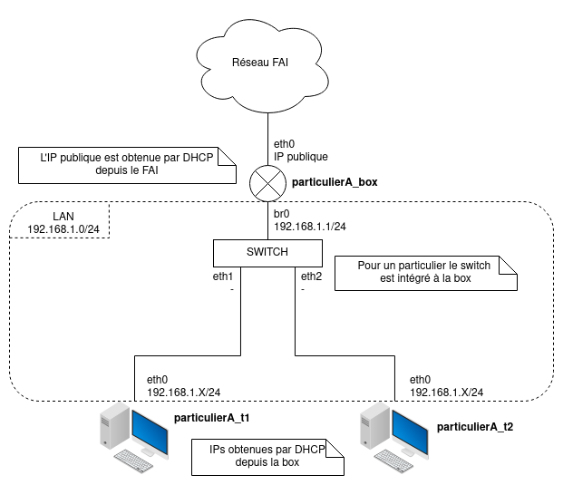

# Réseau de particulier

Un réseau de particulier est composé de :
- Une box jouant le rôle de **serveur DHCP** pour la LAN et de point d'accès via **NAT** vers le réseau de l'opérateur.
- La box établit un **PPPoE** vers le FAI pour obtenir son IP WAN.
- Deux machines connectées à la box.

Les réseaux de particuliers possède un identifiant (A,B,C,...) défini par l'utilisateur qui permet de les différenciers.

Voici un schéma d'un réseau obtenu en faisant `./start.sh A`


## Procédure de déploiement

Dépendances :
 - Docker

Pour démarrer un réseau de particulier A isolé (avec identifiants PPP en arguments) :
```bash
chmod u+x ./start.sh
./start.sh A alice alicepass
```

Pour démarrer un réseau de particulier A connecté à un routeur extérieur créé automatiquement regardez dans le dossier [tests](./tests).

Pour démarrer un réseau de particulier A connecté à un routeur extérieur R que vous avez préalablement créé :
```bash
chmod u+x ./start.sh
./start.sh A alice alicepass R <interface à utilisée sur R>
```

Pour arrêter un réseau de particulier A :
```bash
chmod u+x ./stop.sh
./stop.sh A
```

## Accès aux machines

Les machines d'un réseau de particulier A ont les noms suivants :
- `particulierA_box` pour la box
- `particulierA_t1`
- `particulierA_t2`

Pour ouvrir un terminal sur une machine d'un réseau de particulier A :
```bash
docker exec -it nom_machine bash
```

Pour ouvrir wireshark en tant qu'une machine du réseau (nécessite Wireshark installé sur l'hôte) :
```bash
sudo ip netns exec nom_machine wireshark
```

## Configuration

Le **DHCP LAN** est configuré dans [dhcpd.conf](./configs/dhcpd.conf) et le **NAT** est configuré dans [script_box.sh](./scripts/script_box.sh).
Lors du démarrage, `start.sh` demande un identifiant et un mot de passe PPP pour la box (utilisés par `pppd`).
